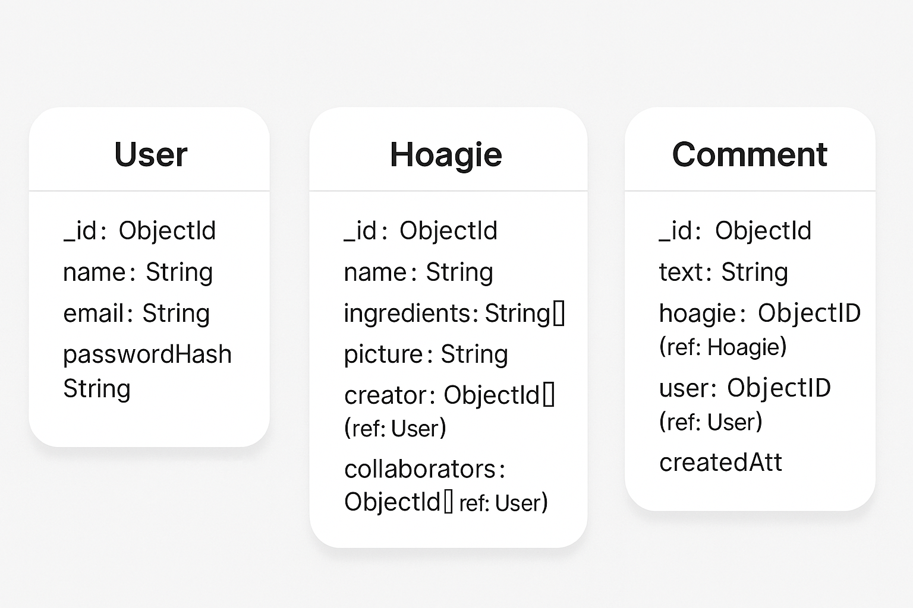

This monorepo is split into two main folders:

└── frontend/ # React Native mobile app (Expo) 
└── backend/ # NestJS API (MongoDB)

Each folder contains its own `README.md` with setup and feature-specific instructions.

---

## 🚀 Quick Start

### 1. Clone the project

```bash
git clone https://github.com/brunogdz/project-hoagie.git
cd project-hoagie
```

### 2. Install dependencies
cd frontend && yarn install
cd backend && yarn install


### Tech

This project uses modern full-stack technologies:

- React Native (Expo) with TypeScript
- Redux Toolkit & Recoil for state management
- Reanimated for polished gestures and transitions
- NestJS for backend APIs with MongoDB
- Modular and scalable architecture in both frontend and backend

### Project Details

Check each folder for deeper information:

frontend/ – UI, navigation, state management
backend/ – APIs, MongoDB models, DTOs, services

### DB Schema



